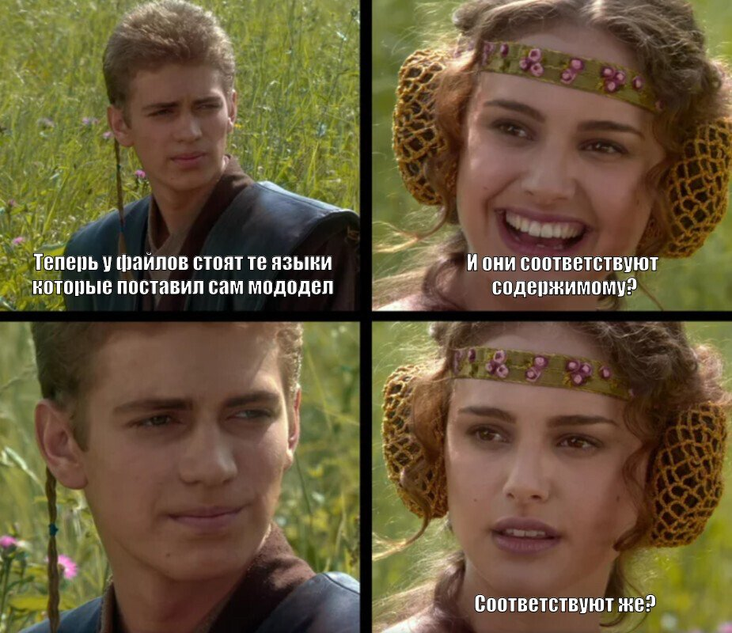
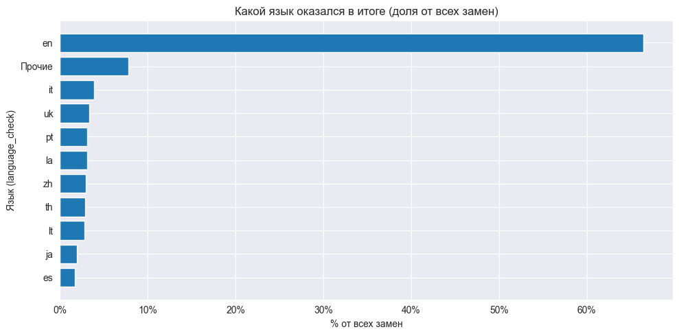
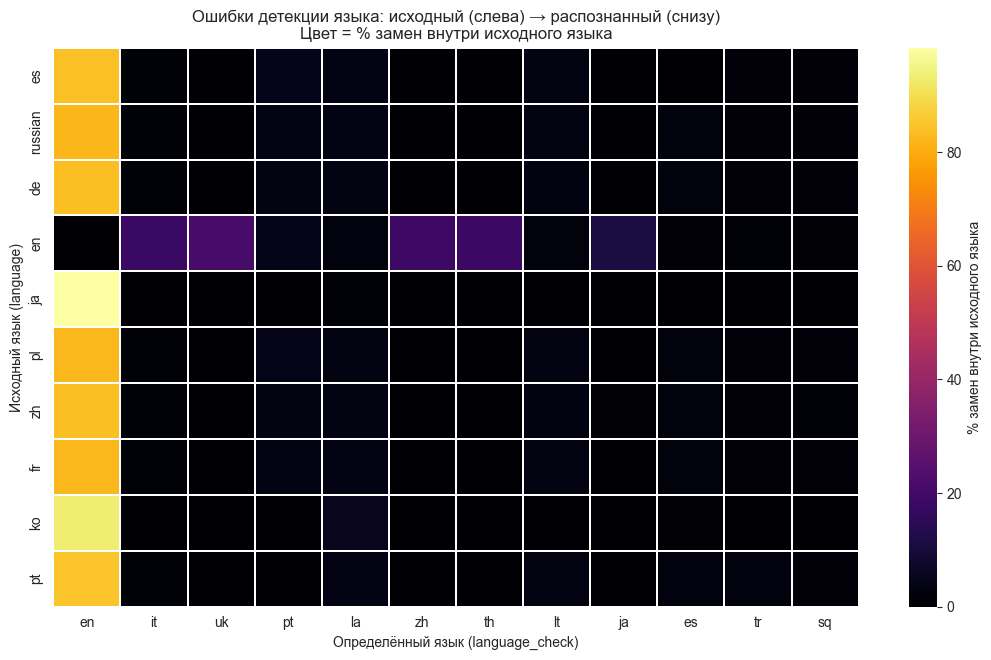
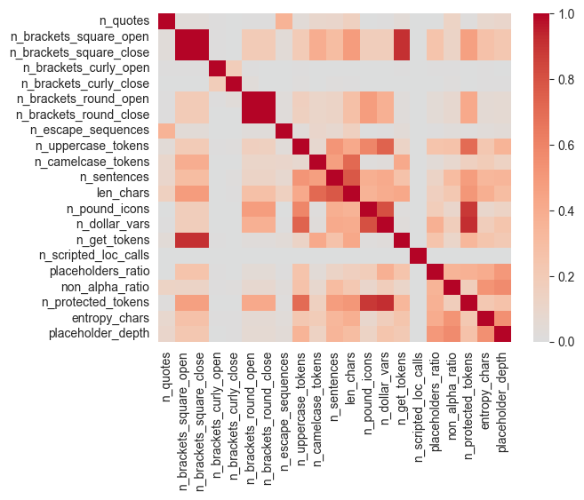
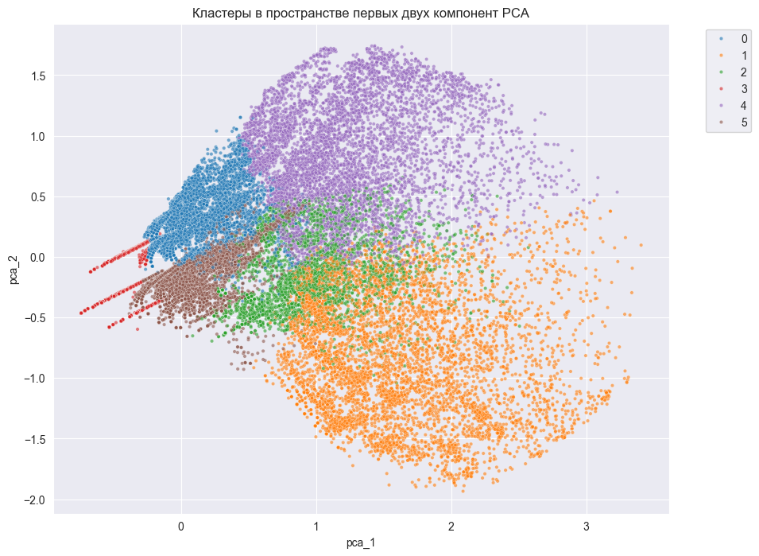
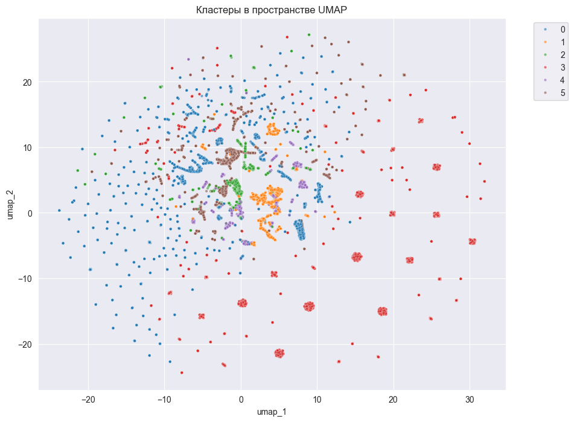
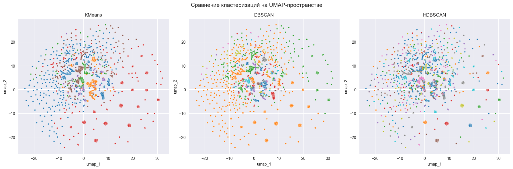

# Отчет по чекпоинту №2  
## Разведочный анализ данных (EDA)

### 1. План работы (ML/DL-трек)

| № | Чекпоинт | Описание | Срок |
|---|-----------|-----------|------|
| 2 | Сбор данных и EDA | Сбор датасета локализаций (целевая платформа — Stellaris). Подготовка тестового набора. Изучение литературы по темам машинного перевода. Проверка концепции использования API готовых моделей для решения задачи при помощи промпт-инжиниринга. Выбор метрик для оценки качества перевода. | Ноябрь |

---

### 2. Описание данных

Данный ноутбук представляет собой разведочный анализ данных (EDA) для файлов локализаций игр Paradox Interactive (в частности, Stellaris), имеющих формат `*.yml`.  
Для сбора данных был проведён парсинг страницы мастерской Stellaris в Steam.  
Всего найдено **34 116** модификаций, из которых скачано **1 599**.  
Из каждой модификации извлекались файлы локализации (при их наличии).

- **Найдено файлов локализаций:** 19 653  
- **Примеры:**
  - `2907704328/localisation/korean/resettlement_tool_l_korean.yml`  
  - `2907704328/localisation/simp_chinese/resettlement_tool_l_simp_chinese.yml`  
  - `2907704328/localisation/japanese/resettlement_tool_l_japanese.yml`  
  - `2907704328/localisation/german/resettlement_tool_l_german.yml`  
  - `2907704328/localisation/russian/resettlement_tool_l_russian.yml`

**Тип данных:** пары ключ: строка перевода.  (и всякий мусор)

---

### 3. Первичный анализ данных

Основная цель анализа — оценить корректность синтаксиса и выявить потенциальные сложности при работе с текстом.

#### Структурные и синтаксические метрики
Используются для проверки корректности синтаксиса и целостности формата:
- **Кавычки:** `n_quotes`, `has_unclosed_quotes` — количество и корректность пар кавычек.  
- **Скобки:**  
  - квадратные — `n_brackets_square_open`, `n_brackets_square_close`, `is_balanced_square`;  
  - фигурные — `n_brackets_curly_open`, `n_brackets_curly_close`, `is_balanced_curly`;  
  - круглые — `n_brackets_round_open`, `n_brackets_round_close`, `is_balanced_round`.  
- **Экранированные последовательности:** `has_escape_sequences`, `n_escape_sequences`.  
- **Прочее:** `has_colon_in_text`, `has_multiline_continuation`.

#### Семантические и лингвистические метрики
Помогают оценить сложность перевода и структуру текстов:
- **Регистр и токены:** `n_uppercase_tokens`, `n_camelcase_tokens`.  
- **Числа и математические элементы:** `has_numeric_token`.  
- **Пунктуация и сегментация:** `n_sentences`.  
- **Длина:** `len_chars` — длина строки в символах.

#### Доменные (игровые) токены
Специфические для Stellaris конструкции, которые не подлежат переводу:
- `n_pound_icons` — число иконок `£icon£`;  
- `n_dollar_vars` — количество переменных `$token$`;  
- `n_get_tokens` — обращения вида `[Root.Owner.GetAdj]`;  
- `n_scripted_loc_calls` — количество вызовов скриптов локализации;  
- `has_color_code` — наличие кодов цвета (`§X`, `§!`);  
- `has_inline_math` — наличие числовых выражений;  
- `is_placeholder_only` — строка состоит только из плейсхолдера.

#### Маркапные метрики
Используются для последующего синтеза или генерации аналогичных данных:
- `placeholders_ratio` — доля плейсхолдеров в строке;  
- `non_alpha_ratio` — доля небуквенных символов;  
- `n_protected_tokens` — количество элементов, требующих защиты при переводе;  
- `entropy_chars` — энтропия символов (оценка разнообразия);  
- `placeholder_depth` — глубина вложенности плейсхолдеров.

---
### 4. YAML который не YAML

При анализе 19 148 файлов локализаций (8 338 021 строк) выявлены ошибки парсинга в 1 745 файлах (≈9,1 %) и 41 157 строках (≈0,49 %). Основная причина — использование диалекта YML Paradox, не совпадающего со строгим YAML.

#### Основные типы ошибок

| Тип ошибки                 | Количество | Краткое описание                                                         |
|---------------------------|-----------:|---------------------------------------------------------------------------|
| `yaml_parse_failed`       |     39 949 | Общие сбои разбора: нарушенные структуры, блоки, индентация, символы     |
| `unclosed_quote`          |        639 | Незакрытые кавычки                                                        |
| `no_key_value_pattern`    |        345 | Отсутствует валидная пара `key: value`                                    |
| `mapping_value_not_allowed` |       93 | Лишние двоеточия/ошибки в маппингах                                       |
| `yaml_block_unterminated` |          4 | Незавершённые блочные скаляры                                             |
| `unknown_error`           |        127 | Прочие/редкие случаи                                                      |

Внутри yaml_parse_failed обычно

`unacceptable character #x0011: control characters are not allowed` — в файле встречены неразрешённые управляющие символы, которые YAML-интерпретатор не может обработать.

`while parsing a block mapping did not find expected key` — нарушение структуры `key: value`, пропущено имя ключа или двоеточие, что делает строку невалидной с точки зрения YAML.

####  Принятые меры
- Предобработка текстов:
  - удаление числовых префиксов перед кавычками (метрика парадоксов);
  - нормализация переносов строк и BOM;
  - корректировка «висячих» значений (`key:\n "value"` → `key: "value"`).
- Построчный парсинг с обработкой отступов и комментариев.
- Восстановление частично корректных пар `key: value` с использованием `ruamel.yaml`.

---
### 5. Обработка языков: нормализация, сопоставление и верификация

#### Кратко о последовательности действий

1) Идентификация меток языка  
Пробегаем по колонке `language`, собираем все уникальные значения, сравниваем с базовым списком. Всё, что не совпало, считаем «псевдометками» и фиксируем частоты/файлы.

2) Поиск конфликтов между метками и путями  
Сопоставляем язык из содержимого с подсказками из имени файла и пути. Если расходятся — помечаем файл как конфликтный.

3) Нормализация и fuzzy-сопоставление  
Приводим метки к канону (строчные, без `l_`, фильтруем `default/unknown`) и пытаемся сопоставить с базовыми языками: точное совпадение, подстрока, расстояние Левенштейна, частичные совпадения; учитываем подсказки пути/имени.

4) Исправление языка по файлу/строке  
Для каждой записи используем результат fuzzy-сопоставления. Возвращаем нормализованный язык или `Unknown`.

5) Присвоение итогового языка  
Агрегируем по файлу, получаем «язык файла», затем транслируем его во все строки этого файла, чтобы заполнить `language` консистентно.

И получаем датасет с языками которые соответсвуют содержимому?


После первичной нормализации оказалось, что часть языков всё ещё определена неверно: многие файлы — это копии английских локализаций с другим языковым тегом. Поэтому добавлен этап **распознавания языка по тексту**.

Использовались несколько библиотек: `fastText`, `langid`, `langdetect`.  
Текст очищался от плейсхолдеров и для каждого файла собиралось до 50 строк, результат записывался в `language_check` и сравнивался с исходной меткой.

- Многие мододелы просто копируют английские тексты и переименовывают язык, чтобы избежать сбоев локали у юзеров.  
- Ложные срабатывания (например, `uk`) редки, но в целом видно, что часть «переводов» — это дубликаты.  
- Без реальной детекции по содержимому невозможно надёжно определить язык файла —  **особенно**, если мододел по каким-то причинам **нигде** не указал, что язык у него тайский.  (А на прошлых этапах файлов у которых язык не свелся к базовому словарю языков было 3 и они были на англе)

  Круто после часов возни с языками увидеть в файле строки вроде:  

  ```
  ิ่งเหล่านี้คือเส้นใยของกาล-อวกาศที่ควบแน่น
  ```

  (и ни единого упоминания о тайском ни в названии, ни в пути), и сидеть [вот так](https://youtu.be/enzNxC9EHNY).


#### Анализ датасета

1) **Подготовка данных**  
Извлекаются строки из всех модов с указанием `mod_id`, `file`, `key`, `text` и определённого языка.  
Удаляются дубликаты и пустые значения, чтобы оставить только уникальные ключи переменных.
2) **Группировка по модам и языкам**  
Для каждого мода формируется множество языков. Если в моде есть русский и хотя бы ещё один язык — он участвует в анализе.
3) **Построение пар языков**  
Для каждого сочетания языков внутри мода создаются пары (например, `russian–english`, `russian–japanese`).  
По каждой паре оценивается наличие общих ключей и совпадение строк по идентификатору.
Для каждой пары считается:
- сколько строк встречаются хотя бы на одном языке (`union_lines`);
- сколько строк переведено на оба языка (`aligned_lines`);
- доля совпадения по плейсхолдерам (`ph_match_rate_aligned`);
- Вычисляется косинусное сходство эмбеддингов (semantic_parallel_score — насколько переводы совпадают по смыслу).

4) **Сводная статистика**  
    Рассчитывается :  
- доля выровненных строк (`align_rate_union`),  
- сохранность плейсхолдеров,  
- количество модов, где встречается пара языков,  
- средняя семантическая схожесть.  


---

#### Наблюдения
| № | Пара языков | union_lines | aligned_lines | align_rate_union | ph_match_lines | ph_match_rate_aligned | ph_match_rate_union | n_mods_with_pair | semantic_parallel_score | n_mods | share |
|---|--------------|-------------|----------------|------------------|----------------|------------------------|---------------------|------------------|--------------------------|---------|--------|
| 0 | en–russian   | 324602 | 118743 | 0.365811 | 116645 | 0.982332 | 0.359348 | 162 | 0.771225 | 162 | 0.301115 |
| 1 | ko–russian   | 158892 | 97317  | 0.612473 | 95980  | 0.986261 | 0.604058 | 34  | 0.743745 | 34  | 0.063197 |
| 2 | fr–russian   | 109005 | 94741  | 0.869144 | 92145  | 0.972599 | 0.845328 | 62  | 0.723304 | 62  | 0.115242 |
| 3 | russian–zh   | 224962 | 91940  | 0.408691 | 90131  | 0.980324 | 0.400650 | 62  | 0.761244 | 62  | 0.115242 |
| 4 | ja–russian   | 92511  | 91929  | 0.993709 | 90965  | 0.989514 | 0.983288 | 31  | 0.769243 | 31  | 0.057621 |
| 5 | es–russian   | 101806 | 90770  | 0.891598 | 89920  | 0.990636 | 0.883249 | 55  | 0.745823 | 55  | 0.102230 |
| 6 | pt–russian   | 96223  | 89930  | 0.934600 | 89399  | 0.994095 | 0.929081 | 46  | 0.740938 | 46  | 0.085502 |
| 7 | pl–russian   | 96006  | 77354  | 0.805720 | 76753  | 0.992231 | 0.799460 | 51  | 0.758537 | 51  | 0.094796 |
| 8 | de–russian   | 101821 | 75408  | 0.740594 | 74411  | 0.986779 | 0.730802 | 64  | 0.748837 | 64  | 0.118959 |
| 9 | et–russian   | 77843  | 3214   | 0.041288 | 3211   | 0.999067 | 0.041250 | 1   | 0.781743 | 1   | 0.001859 |

---
- Наибольшее число пар — у **английского**, **китайского**, **японского**, **корейского**, **французского** и **немецкого**.  
- **Высокое выравнивание (0.7–0.9)** у пар *ja–russian*, *pl–russian*, *fr–russian*, *pt–russian* — хорошие параллели.  
- **Низкое (≈0.23)** у *en–russian*: много непереведённых или односторонних строк.  
- Почти во всех парах **ph_match_rate_aligned > 0.97** — структура и плейсхолдеры сохраняются.  
- **Семантический параллелизм 0.7–0.9** у японского, корейского, польского, французского и португальского языков.  (реально совпадает)
- **Английский–русский** и **китайский–русский** имеют слабое совпадение по смыслу, вероятно из-за машинных переводов (такое делают, но ручками и плохо, для китайских точно).

---

#### Выводы

Датасет хорошо подойдет для проверки работы переводчика модов. Сохранность плейсхолдеров большая, а если от перевода семантическое сходство вырастет то будет еще лучше. По сути мы можем получить базовый метод оценки правильности сделанного перевода, для обучающего датасета.
Модельку для перевода текста с 0 обучить не выйдет, даже если будут мощности, придется делать надежный аугментатор данных, который еще и теги потом в нужные места проставит. Такой проще делать из имеющихся параллельных датасетов, где через NER именованным сущностям будут подставляться игровые теги. Работать именно с модами в таком направлении не стоит - больше усилий будет потрачено на очистку исходный файлов и работу с ними (как оказалось я много чего не знал про подноготную локализационных файлов).
В контексте работы с LLM и тюнингом датасет пойдет.

  ### 6. Анализ структуры текстов и выводы по метрикам

После анализа языков и параллельности датасет был исследован с точки зрения **внутренней структуры строк** — это важно для построения аугментатора и синтезатора данных.  
Оценивались синтаксические, лексические и форматные метрики, влияющие на пригодность локализаций для обучения и перевода.

---

#### **Общая характеристика**

- Всего в выборке около **8,34 млн строк** из файлов локализаций.  
- Средняя длина строки — **34 символа**, медиана — **9 символов**.  
  Распределение сильно скошено вправо: преобладают короткие тексты, отдельные строки очень длинные.  

---

#### **Синтаксис и форматирование**

- Примерно **половина строк не содержит служебных символов**: кавычек, скобок, escape-последовательностей или переменных.  
  Средние значения по метрикам (`n_quotes`, `n_brackets_square_open` и т.д.) близки к нулю.  
- Встречаются **единичные строки высокой сложности**: до сотен кавычек, скобок или переменных.  Но если споткнемся в итоге на них и мод все равно не запустится.

---

#### **Лексические особенности**

- **CamelCase и идентификаторы** встречаются почти в каждой строке (в среднем 1–1.3 на строку).  
- **Заглавные токены** (например, аббревиатуры) редки, но встречаются в отдельных длинных строках.

---

#### **Плейсхолдеры и специальные конструкции**

- Средняя доля плейсхолдеров (`placeholders_ratio`) ≈ 0.046, медиана = 0 —  
  большинство строк не содержит переменных, но отдельные состоят из них почти полностью.    
- Небуквенные символы занимают в среднем ≈ 9 % строки — преобладает чистый текст.

---

#### **Информационная насыщенность**

- Средняя энтропия символов (`entropy_chars`) ≈ 3.12 бит, медиана ≈ 2.95, максимум ≈ 7.98.  
  В целом похоже на типичную структуру естественного языка.

---

#### **Практические выводы**

1. **По структуре строки близки к обычным параллельным корпусам.**  
   Можно использовать существующие параллельные корпуса как источник для синтетических данных.

2. **Низкая плотность тегов упрощает синтез разметки.**  
   Так как служебные символы встречаются редко, можно **генерировать разметку искусственно**, подмешивая теги и переменные к обычным фразам.

3. **Высокая вариативность метрик позволяет управлять сложностью данных.**  
   Возможно создание "контролируемого шума": смешение 90 % простых и 10 % «сложных» строк с множеством тегов и переменных.

4. **Параметризация генерации разметки.**  
   Частоты встречаемости позволяют задать вероятности вставки токенов:
   - `$var$` — около 10 % строк,  
   - `[Get...]` — около 7 %,  
   - `£icon£` — около 4 %,  
   - `§R/§!` — около 2 %.  

---
### 7. Анализ метрик и типизация строк

#### **Корреляции между метриками**

На первом шаге смотрим взаимосвязь между числовыми признаками, чтобы откинуть лишние.  
Вычисляется корреляционная матрица, чтобы выявить группы сильно связанных метрик.  
Например, метрики `n_protected_tokens`, `n_dollar_vars`, `n_pound_icons` имеют высокие коэффициенты корреляции —  все они описывают различные виды «защищённых» элементов внутри строки.

Для оценки избыточности признаков возьмем **Variance Inflation Factor (VIF)**.  
Метрики с очень высоким VIF (например, `n_protected_tokens` или `n_dollar_vars`) уберем.


| № | feature | VIF |
|---|----------------------------|------------------:|
| 18 | n_protected_tokens | 357045.102462 |
| 13 | n_dollar_vars | 116503.644688 |
| 12 | n_pound_icons | 61966.546852 |
| 14 | n_get_tokens | 35193.235174 |
| 2  | n_brackets_square_close | 6731.043017 |
| 1  | n_brackets_square_open | 6728.756881 |
| 5  | n_brackets_round_open | 2111.427449 |
| 6  | n_brackets_round_close | 2108.521564 |
| 11 | len_chars | 5.943639 |
| 4  | n_brackets_curly_close | 4.211877 |
| 10 | n_sentences | 3.987443 |
| 9  | n_camelcase_tokens | 2.855445 |
| 8  | n_uppercase_tokens | 2.788115 |
| 17 | non_alpha_ratio | 2.705091 |
| 19 | entropy_chars | 2.428991 |
| 20 | placeholder_depth | 2.273717 |
| 3  | n_brackets_curly_open | 2.017937 |
| 16 | placeholders_ratio | 1.997299 |
| 0  | n_quotes | 1.195342 |
| 7  | n_escape_sequences | 1.184381 |

---

#### **Снижение размерности и нормализация**

Чтобы визуализировать и сгладить распределения:
- логарифмируем скошенные признаки (например, длина строки);
- обрежем по квантилям (winsorize);
- нормализуем при помощи `RobustScaler`.  
И применим **PCA** (Principal Component Analysis), чтобы свести многомерные данные к 2 главным компонентам.



Модель объясняет около **65 % общей дисперсии**, что ну норм.

---

#### **Нелинейное уплотнение через UMAP**

Для более точного разделения классов применим **UMAP (Uniform Manifold Approximation and Projection)**,  
который лучше сохраняет локальную структуру данных и подходит для текстов с неоднородными признаками.  



---

#### **Сравнение кластеризаций**

Посмотрим KMeans, DBSCAN и HDBSCAN для проверки устойчивости кластеров.  
Все три подхода дают схожую структуру, где можно выделить 5–6 устойчивых типов строк.



---

#### **Интерпретация кластеров**

Результаты кластеризации позволили выделить **шесть устойчивых групп текстов**, различающихся по структуре, длине, энтропии и насыщенности специальными токенами.  
Ниже кратко описаны характеристики каждой группы.

---

##### **Кластер 0 — `short_sent`**
- Средняя длина строки: **3.01**
- Энтропия символов: **3.60**
- CamelCase-токены: **0.66**
- Доля плейсхолдеров: **0.02**

Короткие фразы и интерфейсные элементы.  

---

##### **Кластер 1 — `game_code`**
- Средняя длина строки: **1.71**
- Энтропия символов: **2.02**
- CamelCase-токены: **0.48**
- Доля плейсхолдеров: **0.00**

Структурированные строки с элементами форматирования (`§`, `£`, `$`).  

---

##### **Кластер 2 — `template_text`**
- Средняя длина строки: **4.11**
- Энтропия символов: **4.35**
- CamelCase-токены: **0.82**
- Доля плейсхолдеров: **0.19**

Строки с шаблонными элементами и подстановками (`$VAR$`, `[Root.GetAdj]`).  

---

##### **Кластер 3 — `entity_name`**
- Средняя длина строки: **2.11**
- Энтропия символов: **2.65**
- CamelCase-токены: **0.69**
- Доля плейсхолдеров: **0.00**

Короткие собственные имена — персонажи, планеты, сущности.  

---

##### **Кластер 4 — `narrative_text`**
- Средняя длина строки: **2.13**
- Энтропия символов: **2.73**
- CamelCase-токены: **0.32**
- Доля плейсхолдеров: **0.00**

Кластер представлен повествовательными или описательными текстами, включающими связные предложения. Характеризуется умеренной длиной и средней энтропией, по сути литературно-описательные фразы на естественном языке.

---

##### **Кластер 5 — `localized_snippet`**
- Средняя длина строки: **2.58**
- Энтропия символов: **3.26**
- CamelCase-токены: **0.95**
- Доля плейсхолдеров: **0.01**

Многоязычные короткие фрагменты, часто с символами разных алфавитов.  

---

### **Обобщение**

В целом понятно какие типы данных нужно генерировать - и тем более понятно что задача вполне покрывается параллельными датасетами. И как рабочий вариант - синтез датасета с применением обратного перевода на основе литературных произведений - будет самое оно.

## 8. Выводы
На основе EDA и [анализа литературы](./Literature_Review.pdf)  можно вывести 2 направления работы. 

---

#### **1. Система перевода с LLM во главе**

Основная идея — использовать крупную языковую модель (LLM) в качестве главного переводчика, обеспечивающего:
- **инвариантность игровых токенов** (`$VAR$`, `[Root.GetAdj]`, `§G...§!`, `£icon£`);
- **терминологическую согласованность** — идентичные игровые термины должны переводиться одинаково во всех строках;
- **самопроверку перевода** — LLM должна сама оценивать корректность переноса токенов и форматирования, сравнивая результат с оригиналом (либо использовать для этого менее тяжелую LLM).

---

#### **2. Дообучение существующей модели перевода под задачу сохранения разметки**

Второе направление — **адаптация или дообучение существующей модели**  
для корректной работы с игровыми разметками и токенами.

Для этого потребуется подготовить специализированный **обучающий датасет**, включающий:
- пары предложений с игровой разметкой и их корректными переводами;
- синтетические данные, созданные с помощью **аугментатора разметки**;;
- потенциально — **систему определения разметки** — компонент, выделяющий и заменяющий теги временными маркерами перед подачей текста в модель, с последующим обратным восстановлением.

---

#### Немного о том, что не вошло во 2-й чекпоинт

Код для перевода модов через гроковские модельки уже есть — пока прогнал через него свой модпак.  
Крупные модели справляются нормально (`openai/gpt-oss-120b`, `llama-3.3-70b-versatile`): ручное редактирование требуется, но в целом терпимо.  
Работает пока довольно медленно и нормально всасывают токены, но это я батчи не внедрял и так-то не работал над оптимизацией.  Иногда выплёвывают блоки рассуждения.

Модельки поменьше уже хуже справляются — и с поддержанием формата ответа, и с качеством самого перевода.

Сейчас в планах прогнать переводчик на доступных параллельных парах и посмотреть совпадение плейсхолдеров и семантическую близость,  
затем сравнить это с исходным вариантом. После этого — поэкспериментировать с метриками для проверки и уже думать в сторону улучшения функционала и продумывания архитектуры итогового решения. Чтобы понять примерно как в итоге будет выглядеть и поставляться сервис, придется ли обучать что-то свое.