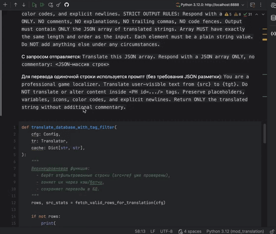
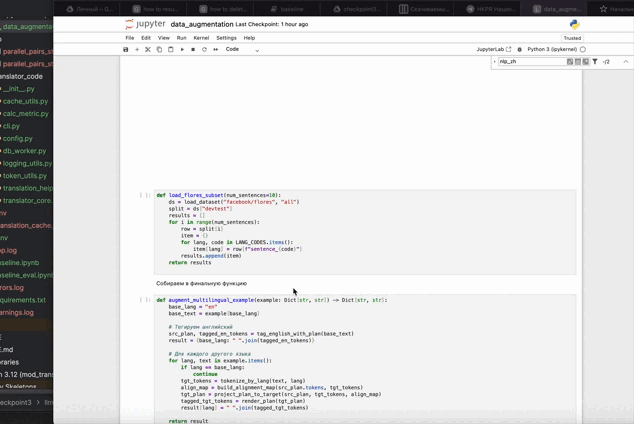

# **Чекпоинт 3**

В рамках третьего чекпоинта было необходимо:

- Определить [ключевую метрику](https://colab.research.google.com/drive/1QBJ56ji0laVdfHEMe2ICO0IiU6BPvDd0?usp=sharing)

- Сделать [бейслайн](https://colab.research.google.com/drive/13wgP6uZHvAynI7C20FFQtFqjkC4BYbn5?usp=sharing) и [оценить](https://colab.research.google.com/drive/1SCZTgRdNg2Y5hUr3jycSe4Fjajn8A6X3?usp=sharing) его

- Попробовать провести [аугментацию данных](https://colab.research.google.com/drive/12f7bBpo63AQYX8EoMTwTtRROsfzEKDOx?usp=sharing) 

  `Для запуска кода лучше всего использовать колаб, в местах где рассчитывается метрика скачивается модель для COMET, она требует указания HF_TOKEN (токена хаггинг фейса) в числе секретов гугл коллаба.` 

  **NEW:** Google Colaboratory lets you define [private keys](https://twitter.com/GoogleColab/status/1719798406195867814) for your notebooks. Define a HF_TOKEN secret to be automatically authenticated!

При решении задачи перевода файлов локализации, содержащих разметку, нужно, чтобы итоговый файл (пункты расположены по убыванию приоритета):

1. **Запустился**

   А значит, имел разметку без артефактов и повреждений.

2. **Отрендерился**

   Теги были не изменены в процессе перевода.

3. **Сохранил исходную информацию**

   Содержал те теги и слова (смыслы), что были в исходном файле.

4. **Был приемлемым для игры**

   Имел приемлемое качество перевода, не отвлекающее от игрового процесса.

Получается, что итоговая метрика должна учитывать структуру тегов и качество перевода, при этом **сохранение структуры тегов приоритетнее качества перевода**.

## Определение ключевой метрики

Для оценки качества перевода с сохранением разметки в проекте выбрана **собственная ключевая метрика**, отражающая степень сохранности тегов. Она включает метрику **tag_score**, для оценки качества сохранения тегов и целостности перевода и метрику **COMET**, для оценки качества перевода.  В процессе вычисляются вспомогательные показатели:

- **Полнота тегов (tag content score)** – доля тегов каждого типа, которые присутствуют в переводе. Иными словами, для каждого вида тегов рассчитывается процент тегов из исходной строки, сохранившихся в переводе. Затем эти доли комбинируются в общий показатель. При этом потеря разных тегов оценивается с разным «весом»: наиболее критично сохранение переменных `$...$` и скриптов [...] (у них больший вес), чуть менее – иконок `£...£`, и наименее критично – цветовых кодов (§Y…§!), так как их отсутствие не ломает смысл. 
- **Корректность структуры тегов (tag structure score)** – сравнение вложенности тегов между оригиналом и переводом. Для этого строится древовидная структура тегов в строке. Метрика проверяет, что в переводе теги расположены в правильной иерархии. 
- **Компилируемость (compilability)** – бинарный индикатор того, можно ли загрузить перевод в игру. Он равен 1, если **нет явных ошибок разметки**: всех открывающихся тегов есть парные закрывающиеся, нет недопустимых вложений (например, тег [... ] внутри `$...$` недопустим), количество символов $, £, [ соответствует ожидаемому. Если обнаружена структурная ошибка (несовпадение пар тегов, неправильное вложение), этот показатель обнуляется, и такой перевод считается непригодным независимо от остального.
- **Качество перевода текста (text quality)** – оценка собственно перевода с точки зрения сохранения смысла и лингвистической корректности. Для автоматической оценки семантики используется метрика **COMET** (модель Unbabel/wmt22-comet-da), обученная оценивать качество машинного перевода по сопоставлению с эталонным человеческим переводом. COMET выдает балл от 0 до 1, где 1 означает идеальное соответствие по смыслу. В нашем случае COMET считается на очищенных от тегов строках (оценивает перевод только текста, игнорируя специальные токены).

**Итоговая интегральная метрика** для перевода строки комбинирует факторы в порядке приоритета: сначала проверяется компилируемость, затем учитывается сохранность тегов, и затем накладывается штраф за плохой перевод. Формула финального балла: 

`final_score = compilability * tag_score * text_penalty(text_score)`

`text_penalty` применяется к переводу с результатом COMET меньшим чем 0.7, она повышает вес плохого перевода заваливая общую метрику.

## Бейслайн

В качестве бейслайн-модели выбран подход на основе **LLM**. Основные характеристики бейслайн-решения:

- **Модель:** использована большая языковая модель семейства Llama (вариант llama-3.1-8b-instant) с доступом к ней через API сервиса **Groq**. Модель достаточно компактна (8 млрд параметров) и теоретически может быть запущена и локально (на моем пк) и имеет большие лимиты запросов.
- **Входной формат:** модели отправляется системный промпт и промпт для перевода строки (или батча строк). Сами исходные строки передаются в модель в виде JSON-массива, чтобы явно структурировать ввод и попросить на выходе такой же формат.
- **Препроцессинг:** перед отправкой в модель теги заменяются на заглушки вида 
  - `<PH id=""/>`.
- **Постпроцессинг:** ответ модели парсится – из JSON-массива извлекаются переведённые строки.  На место заглушек восстанавливаются теги. 

**Алгоритм  перевода** состоит из нескольких этапов:

1. **Защита тегов**

   В исходном тексте все элементы вида `$VAR$`, [Root.GetName], £icon£, §Y...§! и другие структурные токены заменяются на безопасные заглушки `<PH id=""/>`.

2. **Батчевый перевод через LLM**

   Строки отправляются в модель батчами.

   Для ответа действуют строгие правила: модель должна вернуть **только JSON-массив**, без комментариев и форматирования (часть комментариев необратимо будет, их снимаем автоматически).

3. **Обработка ошибок, rate-limit**

   На данный момент можно использовать:

   - ротации нескольких API-ключей,
   - переход на резервные модели (в рамках базовой модели не используется).

4. **Восстановление тегов**

   После получения перевода все заглушки восстанавливаются обратно в исходные теги.

5. **Запись результата в БД**

   Каждый перевод сохраняется в таблицу translated_texts с указанием модели, времени и ID исходной строки.

   (Используется база данных SQLite, т.к. строки неизбежно имеют символы ломающие сохранение в текстовых файлах)

## **Оценка бейслайн**а

После получения переводов с помощью бейслайн-модели рассчитаем для них нашу метрику. Для оценки и перевода использовались строки из пары en-ru. Исходный язык en, целевой ru. 

Итоговая метрика для бейслайн-модели была рассчитана как среднее по тестовому набору. По результатам прогона получилось 0.6959. Для того чтобы это число что-то значило нужно провести сравнение с другими моделями и желательно дополнительным выводом составляющих этой метрики. Но эту задачу я оставляю до следующего чекпоинта.

Главный минус применения метрики - долгий расчет из-за ограниченных ресурсов. Кроме того метрика нейросетевая и требует подгрузки модели, если просто хранить все расчеты в памяти можно упереться в кап ОЗУ коллаба. Проблему пофиксил оптимизацией кода и кешированием в процессе выполнения в файлик. Но вычисление на 1000 строк все равно заняло час. (Не думаю что это большая проблема, почти как билд приложения или проход пайплайнов при деплое). Плюс распараллелить на коллабах можно при большом желании.

Отказываться от COMET мне не хочется, это метрика хорошо зарекомендовавшая себя в работах и она близка к человеческой оценке. Заменять ее ради ускорения процесса оценки решения я не хочу.

## Аугментация данных

Для аугментации данных можно взять готовые датасеты с параллельными парами на разных языках. (хорошо что их много). Дальше в эти данные нужно поставить теги. Тут я вижу 2 пути:

1. Заставить LLM заменять слова на теги во всех парах. Заставить LLM проверить себя (и либо откинуть плохое, либо дать исправить)
2. Сделать алгоритмическое правило для проставления тегов. Проставлять теги в исходном предложении и переносить их на соответствующие смысловые части. Для этого можно использовать инструменты определяющие соответствия между словами на разных языках (они используются в сфере машинного перевода)

Так-то оба эти подхода предполагают множество потенциальных реализаций и простор для экспериментов огромен. На данный момент т.к. потребности в аугментированных данных нет я рассмотрю только 2 вариант. 

Для работы был взят датасет [Flores](https://huggingface.co/datasets/facebook/flores) (потому что его было легко использовать и не долго качать).

Для простановки тегов были заданы вероятности их появления (на глаз) и правила их вставки в предложение (на место/вокруг каких частей речи).

Алгоритм обработки таков:

- токенизация предложения
- построение структуры тегов (вокруг токенов)
- вставка тегов в текст (на соответствующие токены)

По результатам работы можно сказать что как proof of concept подход работает отлично. Нормально токенизируются даже иероглифы, линковка токенов для них тоже работает. Местами ломается грамматика от вставки токенов (падеж не согласуется, такие иероглифы не используются в таком контексте и т.д.), но это можно обойти задав адекватные правила для замены слова на токен. 

## Выводы

По результатам прогона базовой модельки стало понятно несколько моментов:

1. Для чисто локального решения нужен не LLM подход. Чтобы улучшить результат перевода легких моделек нужны ресурсы, которых у пользователя продукта (результата проекта) не будет. Не считаю это проблемой, т.к. можно всегда дать возможность юзеру ввести свой АПИ ключик для любой LLM, которую он захочет. Надо только предусмотреть для этого удобный интерфейс, с возможностью настройки промптов, пользовательских правил очистки ответа модели, и интерфейса для редактирования итогового файла (хотя бы просмотра потенциальных ошибок и сличения с исходником). После этого продукт будет вполне приятным.

2. Промпты для LLM можно и нужно допилить, возможно сменить/добавить какой-то этап проверки/помощи при генерации результата.

3. Для работы с нефиксированным типом тегов нужно придумать инструмент - сейчас самая большая проблема для работы с другими играми - это их уникальная разметка. (Смотрю в сторону чего-то NLP подобного)

4. Пока я делал аугментацию данных поработал с simalign (библиотека которая помогает сопоставлять токены в тестовых данных на разных языках) и теперь не могу отделаться от мысли, что она может как-то помочь в моем процессе работы с тегами. (правда пока не знаю как) 

5. Удивительно, но почему-то я пока не заметил моментов с отказом в переводе из-за характера контента.

6. Любую проблему можно заткнуть LLM-кой были бы ресурсы.

~~я хочу ресурсы рррррр~~

(Пока доп ресурсы не нужны) Сейчас сконцентрируюсь на обертке для сервиса чтобы сдать чекпоинт 4, постараюсь придумать архитектуру которая позволит не зависеть сильно от выбранного метода перевода.

P.S. Увлекательная работа в ноутбуке (я все еще пытаюсь выработать себе приемлемый пайплайн работы)

