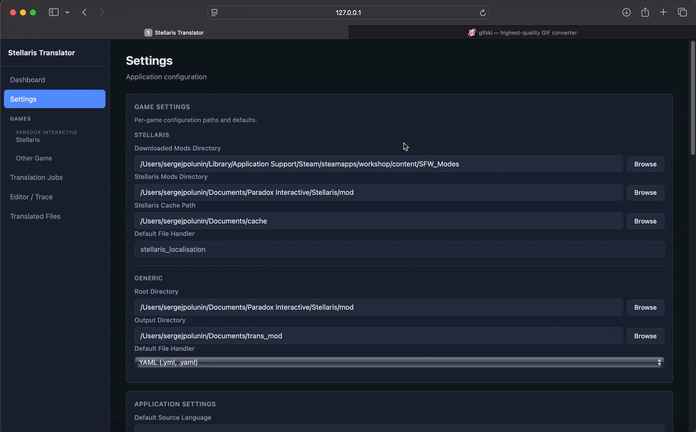
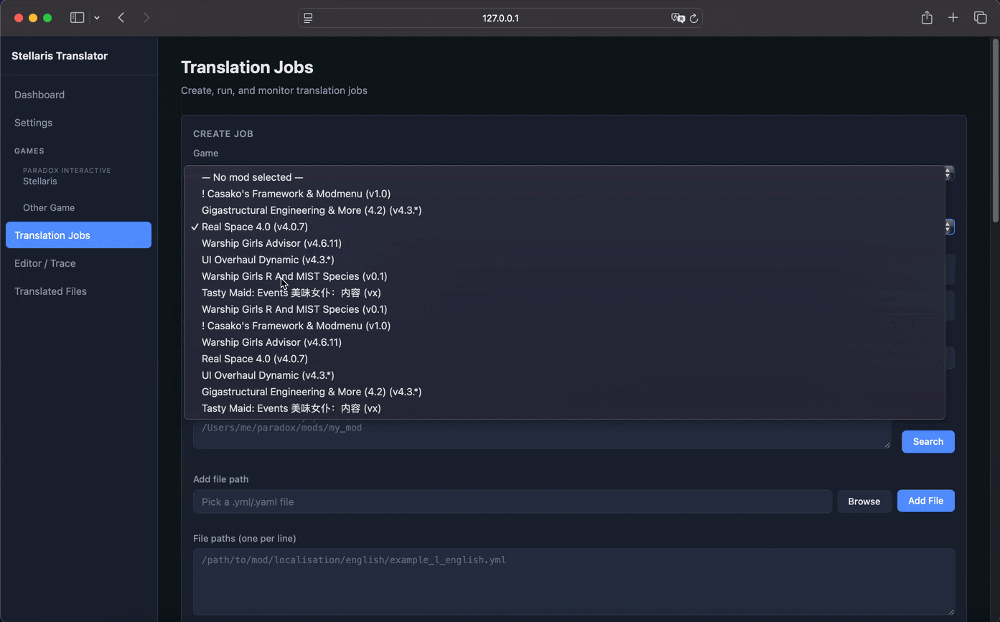
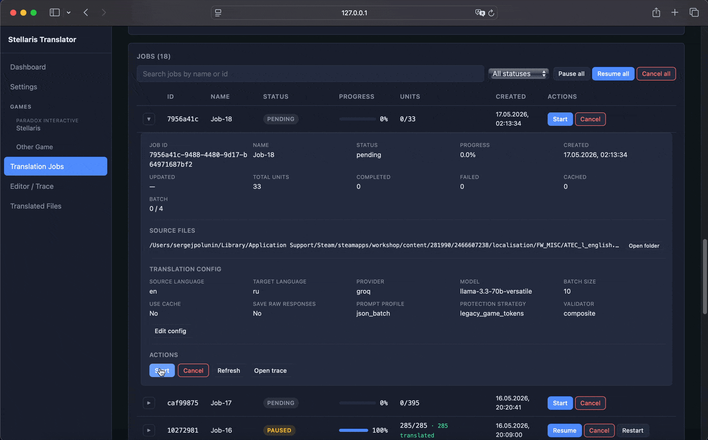

# **Возможности реализованного приложения - полный пользовательский флоу**

## **Общая архитектура**

Проект представляет собой локальное desktop/web-приложение для перевода игровых модов через LLM-модели с полноценным конвейером обработки: от обнаружения модов (пока стеллариса) и построения джобы перевода до редактора перевода.

Архитектурно система построена как модульная платформа перевода с разделением на:

- пользовательский интерфейс;
- серверный API;
- подсистема выполнения переводов;
- слой обработки файлов;
- слой хранения данных;
- подсистема проверки и валидации;
- редактор;
- подсистема диагностики;
- система управления выходными файлами.

Основой конвейера перевода является benchmark/runtime архитектура из checkpoint5.

------

# **1. Запуск приложения**

После запуска серверной части:

- поднимается FastAPI API;
- инициализируется SQLite-хранилище (я фанат постгри но она не для локальной аппки);
- загружаются настройки;
- восстанавливаются состояния задач;
- активируются сервисы выполнения переводов (не автоматически);
- запускаются фоновые обработчики.

Пользовательский интерфейс подключается к серверному API и получает:

- состояние приложения;
- список настроек;
- реестр доступных подсистем выполнения, провайдеров и предустановленных конфигураций (это штуки для перевода);
- состояние очереди задач;
- кэшированные черновики выбора файлов.

Основные API-маршруты (нас они не интересуют, интерфейсу - ура!):

- `/api/health`
- `/api/app-state`
- `/api/settings/*`
- `/api/translation-jobs/*`

## **Посмотрим как выглядит процесс!**

Интерфейс настроек, посмотрели какие апишные ключи можем добавить, проверили на работоспособность и закинули рабочий ключ в приложение.

------

# **2. Обнаружение модов и файлов**

## **2.1 Обнаружение модов**

Пользователь выбирает папку с модами или отдельную директорию мода (в настройках можно указать путь для стеллариса или не стеллариса мы указываем (пока запущен чисто стелларис)).

Система выполняет:

- рекурсивное сканирование директорий;
- поиск `.mod` descriptor (это штука описывающая мод и его расположение в стелларисе, применяется только при соответсвующем выборе);
- поиск папок `localisation/`(стеллариса);
- нормализацию путей;
- дедупликацию;
- определение метаданных игры и мода.

Поддерживается:

- окружение с несколькими модами;
- вложенные моды;
- группировка выходных данных;
- смешанные структуры файлов.

Для каждого файла сохраняются:

- идентификатор мода;
- название мода;
- идентификатор игры;
- исходный путь;
- относительный путь;
- информация о группировке выходных файлов.

------

# **3. Слой обработки файлов**

После выбора мода запускается конвейер обработки файлов.

Система:

- определяет тип файла;
- выбирает парсер (его мы тоже задаем, на выбор джсон или ямл);
- извлекает переводимые единицы;
- сохраняет промежуточное представление.

Поддерживаются:

- файлы локализации Stellaris;
- игровые YAML-подобные локализации;
- JSON;
- обычный текст;
- универсальные структурированные форматы (потом).

------

# **4. Парсинг локализации**

## **4.1 Парсер Stellaris**

Для Stellaris-файлов сохраняется почти полное соответствие исходной структуре файла.

Каждая строка преобразуется в структуру:

- номер строки;
- исходная строка;
- тип записи;
- ключ;
- версия;
- значение;
- комментарий;
- признак переводимости;
- предупреждения.

Система умеет:

- сохранять комментарии;
- сохранять форматирование;
- сохранять языковой заголовок;
- сохранять порядок строк;
- отличать переводимые и непереводимые записи.
## **Посмотрим как выглядит процесс!**

Сейчас мы зашли в настройки и выбрали путь где лежат загружженные моды под стелларис. Приложение посмотрело на папку, нашло дескрипторы модов вместе с содержимым, распарсила его и представила в виде списка модов и файлов локализации.

В каждом моде файлы сгруппированы по папкам и похожим префиксам названий (так проще понимать где и что лежит). Прямо отсюда можно отправить файлы в джобу для перевода, как по одному, так и группами, так и модами.

В самой джобе нас ждет несколько полей для выбора файлов, поле прописывания путей (и равнозначные чипы снизу), кнопочка чтоб добавить путь через открытие файлового менеджера. Кнопочка чтобы всосать все файлы из папки и кнопочка чтобы выбрать конкретный мод. Несколько модов можно выбрать только через дискавери (Игры-Стелларис).

------

# **5. Создание задачи перевода**

После выбора файлов пользователь создает задачу (джобу) перевода.

Задача содержит:

- список файлов;
- метаданные для каждого файла;
- конфигурацию перевода;
- конфигурацию подсистемы выполнения;
- набор шаблонов запросов;
- стратегию защиты;
- стратегию проверки;
- настройки выходных данных.

Поддерживается:

- задачи с несколькими файлами;
- задачи с несколькими модами;
- восстановление черновиков;
- повторный запуск;
- повторная обработка ошибок.

------

# **6. Настройка перевода**

## **6.1 Конфигурация подсистемы выполнения**

Пользователь выбирает:

- провайдера;
- модель;
- API-ключи;
- резервные модели;
- политику повторных попыток;
- температуру генерации;
- таймаут;
- размер пакета.

Поддерживаемые провайдеры:

- Groq;
- DeepSeek.

Подсистема выполнения включает:

- ротацию ключей;
- политику повторных попыток;
- ограничение частоты запросов;
- переключение резервных моделей;
- отслеживание лимитов и переключение по ключам при наличии нескольких.

------

## **6.2 Наборы шаблонов запросов**

Система поддерживает разные профили запросов:

- `simple_single`;
- `json_batch`;
- `strict_json_batch`.

Слой логики запросов полностью отделен от подсистемы выполнения и оркестрации.

Поддерживаются:

- пакетные запросы;
- резервные одиночные запросы;
- строгий JSON-вывод;
- пользовательские шаблоны;
- логирование запросов.

------

## **6.3 Стратегии защиты**

Перед отправкой текста в модель применяется слой защиты.

Поддерживаются:

- отсутствие защиты;
- классическая для работы защита на PH=k;
- XML placeholders.

Слой защиты:

- защищает игровые токены;
- восстанавливает зашищенные токены после перевода.

------

## **6.4 Конфигурация проверки**

Подсистема проверки выполняет:

- проверку корректности JSON;
- проверку длины ответов;
- проверку целостности токенов;
- проверку тегов;
- проверку возможности парсинга;
- нормализацию ответов.

Поддерживается автоматический переход на одиночный режим, если батч никак не получается обработать.

## **Посмотрим как выглядит процесс!**

Сначала мы как полагается пошабуршались по модам, выбрали файлик что нам понравился, ключик для модельки, взяли дефолт параметры, отключили использование кешированных запросов (за время тестов в некоторые набился мусор, правда на файле в примере все было ок). Открыли продвинутые настройки и посмотрели как выглядят наши промпты (в них есть подставляемые значения под языки и под выходной формат). Свои промпты можно сохранить в такой же пресет. 

В итоге мы тыкнули на просмотр превью таски. Кол-во пакетов и строк нас устроило поэтому джоба создана и готова к запуску.

------

# **7. Конвейер выполнения перевода**

После запуска задачи система строит конвейер выполнения.

Основной поток:

конфигурация -> оркестрация -> защита -> пакетирование -> выполнение -> проверка -> принятие (отрицание) результата -> сохранение

------

# **8. Пакетный перевод**

Конвейер работает по batch-first модели.

## **8.1 Обработчик пакетов**

Обработчик пакетов:

- собирает пакет;
- строит запрос;
- вызывает API модели;
- валидирует ответ;
- принимает пакет либо переводит его на сингл обработку.

Пакетный режим уменьшает:

- Токены на запрос;
- задержку между запросами.

------

# **9. Подсистема надежности выполнения**

По сути модуль арбуза API.

Поддерживаются:

- ротация API-ключей;
- классификация ошибок повторных попыток;
- отслеживание лимитов;
- резервные модели;
- изоляция провайдеров;
- ограничение частоты запросов.

Подсистема выполнения возвращает:

- задержку;
- использование токенов;
- сырой ответ;
- метаданные повторных попыток;
- классификацию ошибок.

------

# **10. Проверка и принятие результата**

После получения ответа:

- подсистема проверки разбирает ответ;
- подсистема исправления пытается исправить ошибки (всякий мусор в виде скобочек, кавычек и т.д. в ответе нейронки);
- слой принятия результата восстанавливает токены;
- строится итоговый перевод.

------

# **11. Кэш переводов**

Приложение поддерживает постоянный кэш переводов (можно включить и выключить отдельно для джоб).

Ключ кэша строится из:

- защищенного текста;
- исходного языка;
- целевого языка.

Кэш:

- уменьшает стоимость повторных запусков;
- ускоряет повторные попытки;
- поддерживает полностью кэшированные задачи;
- интегрирован в конвейер перевода.

------

# **12. Слой хранения данных**

Все данные выполнения сохраняются в SQLite.

Основные таблицы:

- experiments;
- results;
- attempts;
- metrics;
- api_metrics;
- classic_metrics;
- cache.

Сохраняются:

- сырые ответы моделей;

- использование токенов;

- повторные попытки;

- ошибки проверки;

- переведенные строки;

- метрики.

  

  ## **Посмотрим как выглядит процесс!**

  

  Запустили джобу, посмотрели как идет перевод в формате реального времени (на поетые теги не обращать внимания! пресет и промпт просто случайно набранные тестовые значения), посмотрели логи от приложения (сырые, чтобы в случае добавления не API провайдера тоже можно было следить за всем чем хочется не меняя форнтенд), посмотрели историю событий переводов (там же можно посмотреть переводы и их статусы для каждого батча). 

------

# **13. Логи и диагностика**

Во время выполнения задачи система собирает логи.

Логи включают:

- пакеты;
- события выполнения;
- повторные попытки;
- ошибки проверки;
- лимиты;
- переходы на батч/сингл.

------

# **14. Интерфейс задач и отслеживание прогресса**

Пользовательский интерфейс показывает:

- состояние очереди задач;
- прогресс;
- прогресс пакетов;
- количество ошибок;
- количество кэшированных единиц;
- диагностику;
- события выполнения.

Статусы:

- PENDING;
- RUNNING;
- PAUSED;
- COMPLETED;
- FAILED;
- COMPLETED_WITH_ERRORS.

Прогресс учитывает:

- завершенные единицы;

- ошибочные единицы;

- кэшированные единицы.

------

# **15. Встроенный редактор перевода**

  После завершения перевода пользователь может открыть встроенный редактор перевода.

  Редактор поддерживает:

  - построчное отображение оригинала и перевода;
  - построчное редактирование;
  - сохранение изменений;
  - повторную проверку строк;
  - отображение результатов валидации.

  Редактор показывает:

  - исходный текст;
  - итоговый перевод;
  - ключ локализации;
  - комментарии;
  - предупреждения;
  - состояние проверки.

  Поддерживается:

  - проверка тегов;
  - проверка форматирования;
  - проверка компилируемости;
  - повторная сериализация файлов в игровой формат.

  После сохранения:

  - файл повторно сериализуется;
  - сохраняется исходная структура локализации;
  - сохраняются комментарии и форматирование;
  - сохраняется порядок строк.

  Редактор интегрирован в общий флоу и использует те же механизмы.

   ## **Посмотрим как выглядит процесс!**

  

Перешли к перведённым файлам, прогнали анализ, получили метрику компилируемости и строки в которых есть ошибки. Для фикса ошибок есть построчный редактор. Также есть возможность посмотреть полное содержимое файлов перевода (пока без редактирования). В целом флоу останется таким же, однако редактор с кодом будет чуть доработан.

# **16. Что еще?**

- Многие функцие которые заложены в приложение (например функции менеджера модов (установка, перенос очистка кешей игры)) пока не протестированы и не пофикшены;
- Режим работы с другими играми параходов пока не тестировался;
- Режим работы с играми НЕ параходов пока тоже не тестировался;
- Получение списка моделей/интеграция перехода на страничку со списком пока не сделана;
- Возможность редактирования процесса нахождения тегов пока не реализована (надеюсь я ее добью);
- Много багов по всяким разным флоу - все требует ручной проверки и таблицы тестов (а с моими руками ломающими любое приложение работа увеличивается экспоненциально);
- Запуск и развертывание на других машинах НЕ тестировались (это будет отдельная боль, ведь я хочу работать и на винде);
- Кроме приложения параллельно крутились тесты и оценки этих тестов для промтпов для гроковых моделек -- результаты не сводил т.к. во всю погрузился в приложение. Считаю что приложение и красивая демонстрация на данный момент главный приоритет.

В общем вид и работа с приложением мне понравились и уже парочку модов я себе перевёл, на дипсике даже думать не надо, с базовым шаблоном работает отлично. В целом в приложение перекочевали возможности бенчмарка, метрик оценки (в разделе редактора перевода) и прочих наработок что были в процессе, и это приятно. 
