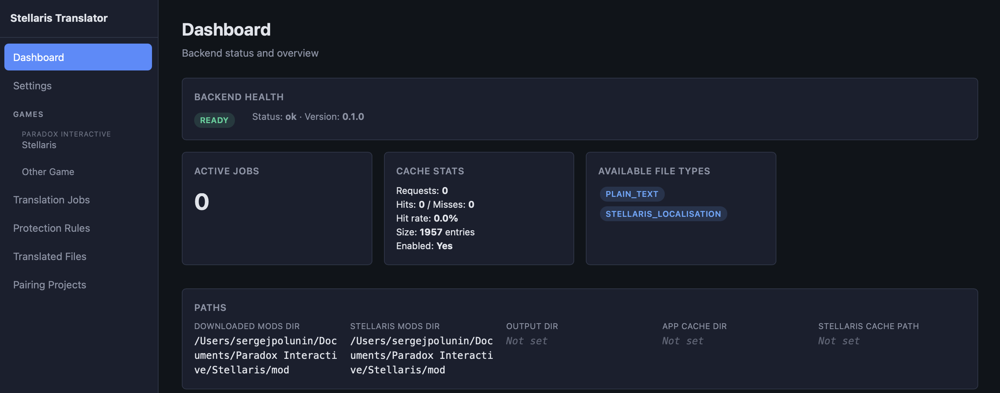
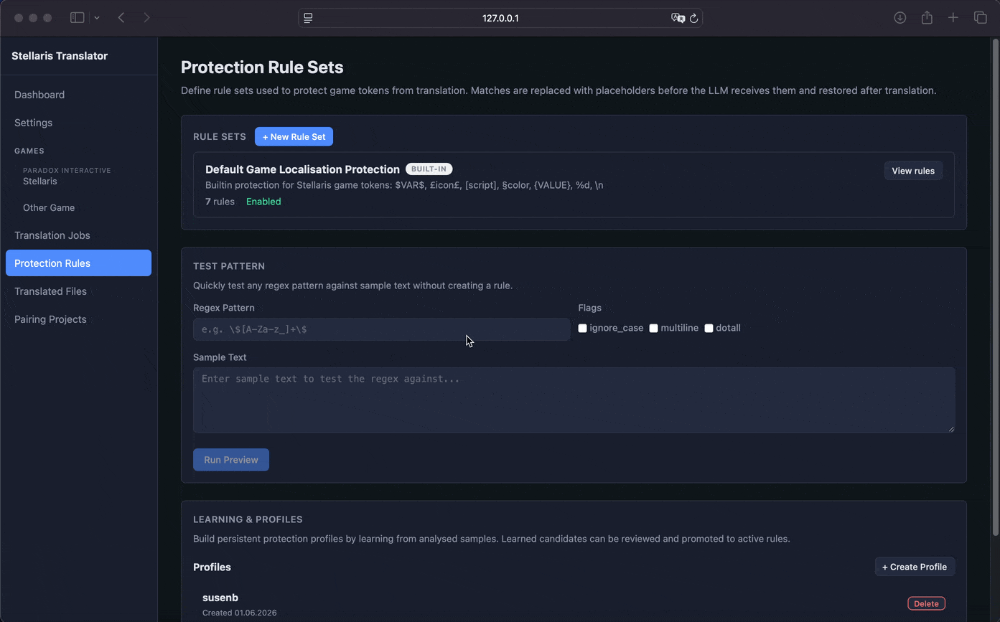
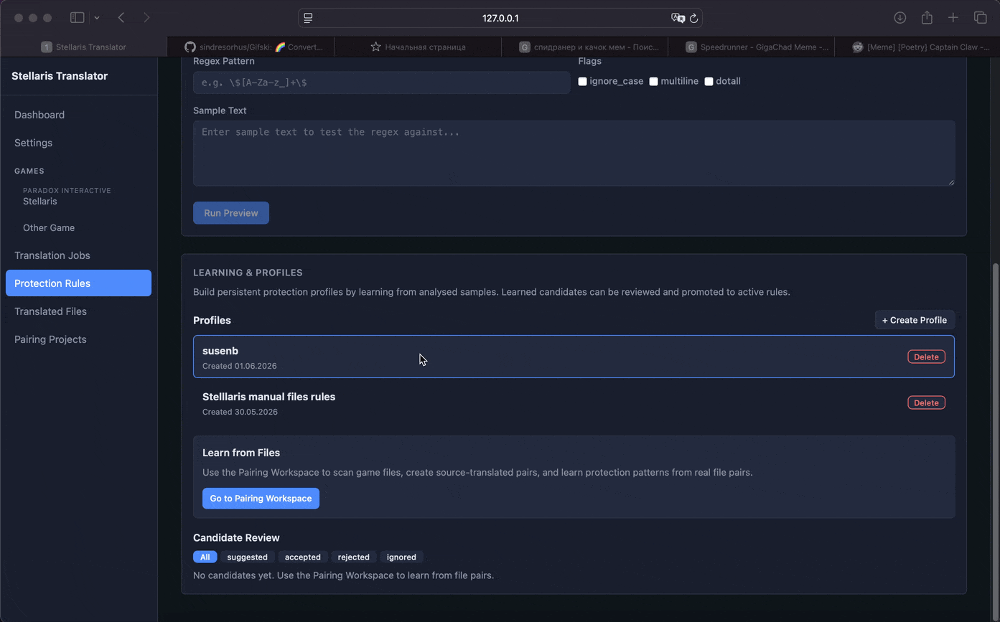
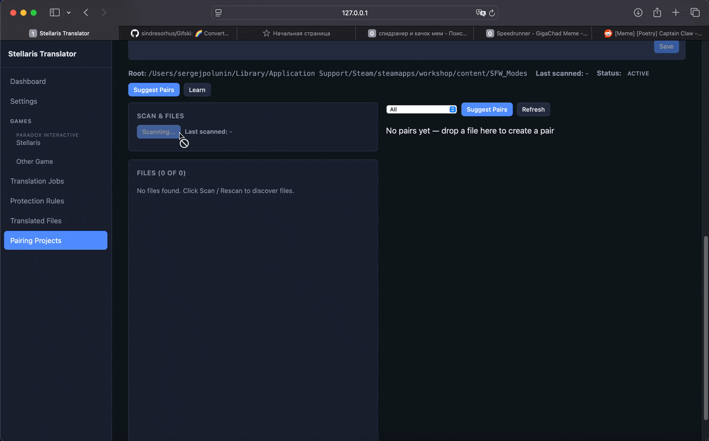
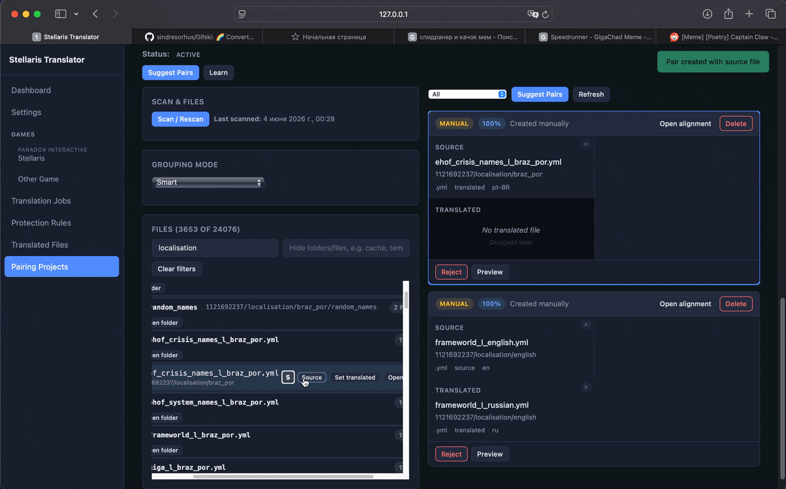

# Отчёт по веб-приложению

В этом отчете я решил описать пользовательские возможности реализованные на данный момент.

## 1. Основные разделы приложения

В приложении реализованы следующие пользовательские разделы:

- Панель мониторинга (Dashboard)

- Настройки (Settings)

- Страницы игр (Game Page)

- Задачи перевода (Translation Jobs)

- Переведённые файлы (Translated Files)

- Правила защиты (Protection Rules)

- Проекты сопоставления (Pairing Projects)

  

  Пользовательские возможности я буду описывать в формате упрощенных юзер стори. Стори 3-9 уже были в предыдущем отчете, поэтому гифок для них не будет.

## 3. Общая схема работы пользователя

Типичный пользовательский сценарий выглядит следующим образом:

1. Пользователь настраивает приложение.
2. Выбирает игру или директорию.
3. Находит файлы локализации.
4. Настраивает/выбирает правила защиты токенов.
5. Создаёт задачу перевода.
6. Запускает перевод.
7. Контролирует выполнение задачи.
8. Просматривает выходные файлы.
9. При необходимости вручную редактирует перевод.

## 4. Пользовательский сценарий: настройка приложения

### Цель

Подготовить приложение к работе.

### Действия пользователя

1. Пользователь открывает настройки.
2. Указывает пути к игре и модам.
3. Добавляет API-ключи.
6. Сохраняет параметры.

### Результат

Приложение готово к созданию задач перевода.

## 5. Пользовательский сценарий: поиск файлов

### Цель

Найти файлы локализации для перевода.

### Действия пользователя

1. Пользователь открывает страницу игры.
2. Выполняет сканирование файлов.
3. Использует группировку и фильтрацию.
4. Выделяет файлы которые нужно перевести.

### Результат

Выбранные файлы добавлены в поля на странице перевода.

## 6. Пользовательский сценарий: создание задачи перевода

### Действия пользователя

1. Пользователь открывает страницу задач перевода.
2. Выбирает/корректирует файлы.
3. Настраивает языки перевода.
4. Выбирает модель.
5. Выбирает правила защиты.
7. Создаёт задачу.

### Результат

Создана задача перевода.

## 7. Пользовательский сценарий: мониторинг перевода

### Действия пользователя

1. Пользователь запускает задачу.
2. Открывает панель логов (TracePanel).
3. Следит за пакетами перевода.
4. Просматривает ошибки и повторные попытки (retry).

### Результат

Пользователь контролирует выполнение перевода.

## 8. Пользовательский сценарий: работа с результатами

### Действия пользователя

1. Пользователь открывает переведённые файлы.
2. Просматривает дерево файлов.
3. Анализирует файлы.
4. Открывает файл в редакторе.

### Результат

Пользователь получает доступ к итоговым файлам перевода.

## 9. Пользовательский сценарий: ручное редактирование

### Действия пользователя

1. Пользователь работает в структурированном режиме (structured mode).
2. При необходимости переключается в режим сырого текста (raw text mode).
3. Проверяет диагностику через панель диагностики (diagnostics panel).
4. Нажимает «Сохранить на диск» (Save to Disk).

### Результат

Исправленный файл сохраняется на диск.

## 10. Пользовательский сценарий: правила защиты

Новая вкладка добавленная в этом чекпоинте. Интерфейс предназначен для создания пользователем собственных правил по которым будет происходить защита игровых конструкций. 

### Действия пользователя

1. Пользователь создаёт набор правил (rule set).
2. Добавляет regex-правила.
3. Выполняет валидацию.
4. Использует правила в задачах перевода.

### Результат

Технические токены и плейсхолдеры защищены от повреждения.

(тут скролл выглядит лагучим - результат конвертации в сжатую гифку)

В общем теперь можно задавать свои правила - задел на работу с играми кроме стеллариса (в эторм чекпоинте как раз приводил часть интерфейса для работы с не стелларисом в порядок). 

## 11. Пользовательский сценарий: проекты сопоставления

Но что нам ручное создание правил если оно может автоматическим? Я тут подумал что при наличии пары локализаций мы можем статистически попробовать сопоставить совпадающие элементы и потом показать их пользователю И может даже придумать для них регекс. Поэтому я занялся интерфейсом сопоставления. Чтобы пользователь мог сам подкорректировать какие файлы и как будут сопоставляться и потом прогнать по ним нашу прогу. 

Правда пока сделано только дерево+создание пар, а пока я фиксил в них баги сломал переход в интерфейс соответсвия и выявления правил. В целом блок в разработке.

### Действия пользователя

1. Пользователь создаёт проект сопоставления.
2. Выполняет сканирование файлов.
3. Использует перетаскивание (drag-and-drop).
4. Настраивает выравнивание строк (alignment).
5. Запускает обучение (learning).

### Результат

Система и пользователь получают данные для создания правил защиты.

(на вкладки не смотреть, хотел найти пример видоса для вывода - не нашел)

DND для фронтендеров или drag&drop - очень муторная в создании и очень удобная в пользовании штука. Принесла мне много боли, и пока в процессе багфиксов.

## 12. Что нужно доделать 

1. В первую очередь необходимо доделать интерфейс сопоставления - сейчас он остался на этапе выбора файлов, все остальное багует/не показывается и тд. В мвп виде на защите планирую его уже иметь.
2. Привести элементы UI к общему знаменателю - кнопки, ползунки, выпадающие списки - их нужно сделать единообразными. В этом я надеюсь клод код разберется, однако запускать этот процесс в состоянии допиливания интерфейса смысла не вижу. 
3. Записать демонстрации работы с отработанным флоу и показом игровых результатов. При этом я хочу показать и вариант незапуска игры и плохого рендера и плохого перевода, а главное **хорошего перевода**. 
4. Красиво собрать все тесты прогнанные за время чекпоинтов чтобы показать значимость проекта. За время прогонов смописного бенчмарка уже есть результаты которые оправдывают и редактирование промптов и защиту тегов, главное красиво и убедительно их показать.
5. Хотелось показать выгоду от использования разработанного приложения - показать процесс с ручным переводом через LLM, пусть даже и мощную, и через приложение. Ограничения по времени не дадут показать подробно, поэтому возможно это сожмется до короткого мемного формата. Но я пока думаю.
6. **Погдотовить презентацию** - правда критерии и требования нам пока не дали, но можно ориентироваться на прошлогодние примеры.
7. JSON - профили. Гениальная идея, если приложение расчитано на комьюнити и личное пользование, то почему бы не дать возможность делиться своими конфигурациями правил/переводов и т.д.
